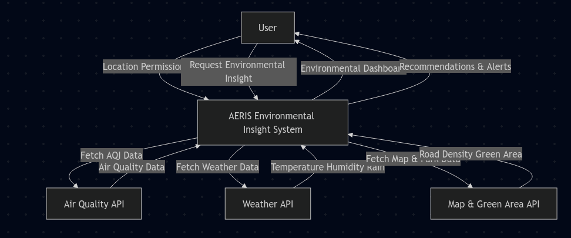
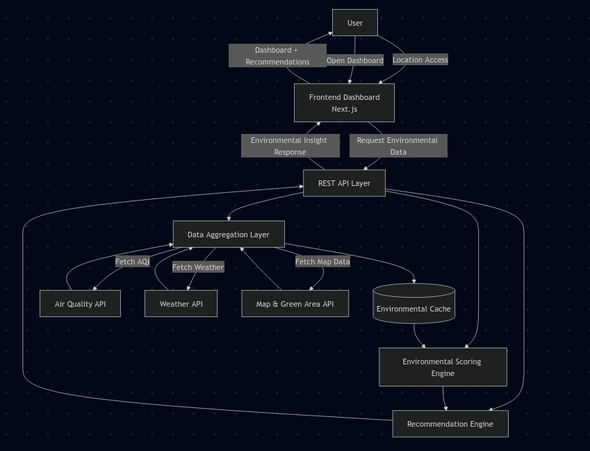
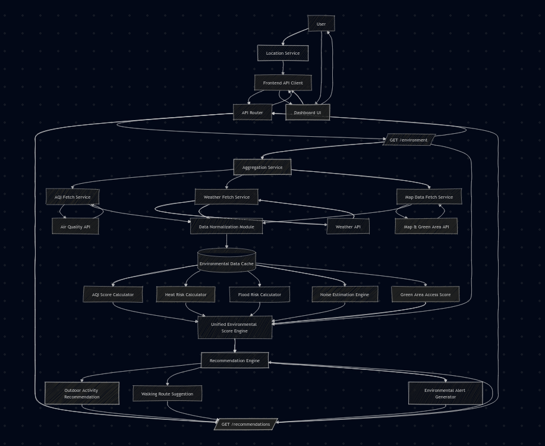
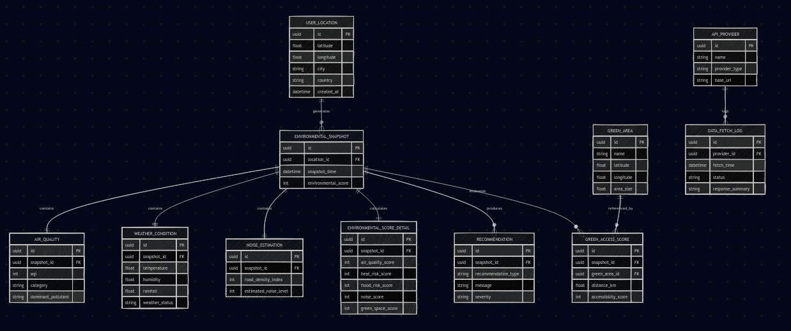
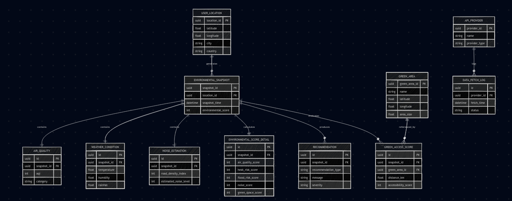

# 🌍 AERIS Frontend

AERIS is a location-aware environmental insight application that helps users understand real-time environmental conditions around them.

The platform transforms complex environmental data into clear, actionable insights so people can make better daily decisions about their surroundings.

This repository contains the frontend application, designed to provide a fast, responsive, and human-centered environmental dashboard.

## 🚀 Project Status

Current development stage:

**Phase 1 — Environmental Insight Interface**

This repository focuses on user experience and environmental data visualization. Backend environmental aggregation services will be developed separately and integrated in later phases.

## ✨ Core Features

### 📍 Location-Based Environmental Dashboard

The system retrieves the user's geographic position and generates environmental insights specific to that location.

Users can quickly understand:

- Current environmental conditions
- Nearby environmental risks
- Accessibility to healthy environments

### 📊 Environmental Score Visualization

Environmental metrics are aggregated into a single interpretable score, calculated from:

- Air quality
- Heat risk
- Flood risk
- Noise estimation
- Green area accessibility

The goal is to provide a simple environmental health indicator for everyday use.

### 💡 Smart Daily Recommendations

Based on current environmental conditions, AERIS generates contextual suggestions such as:

- Avoid outdoor activities during poor air quality
- Stay hydrated in high heat conditions
- Visit nearby green spaces
- Prepare for heavy rain and flood-prone periods

### 🌳 Green Area Accessibility

Users can discover nearby green spaces and their environmental benefits.

The system evaluates:

- Distance to green areas
- Accessibility score
- Environmental impact

## 🧱 Architecture Philosophy

The AERIS frontend follows a modular architecture designed for long-term scalability.

Key principles:

- Separation of UI and data services
- Modular environmental components
- Scalable service layer
- Backend-ready architecture

System layers:

```text
UI Layer
  ↓
Visualization Layer
  ↓
Environmental Service Layer
  ↓
API Integration Layer
  ↓
Backend Environmental Engine
```

## 🗂 Project Structure

```text
AERIS-FE/
├── public/
│   └── requirement/
│       ├── erd.png
│       ├── level0.png
│       ├── level1.png
│       ├── level2.png
│       └── lrs.png
├── src/
│   ├── app/
│   ├── components/
│   ├── services/
│   ├── stores/
│   ├── hooks/
│   ├── utils/
│   └── ...
├── package.json
└── README.md
```

## 🧭 System Design Documentation

System requirement diagrams are available in:

`public/requirement/`

### 📈 Data Flow Diagram

## Notion Link - All Documentasi

- Project View: https://www.notion.so/Project-AERIS-Environmental-Insight-Application-Overview-36f507f991a948afb5ac3655e533def1?source=copy_link

- Ganchart: https://www.notion.so/3171c6bbb420807e96f6f3f56a9d88a5?v=3171c6bbb420806d94c0000cd78dc57d&source=copy_link

#### Level 0 — System Context

Shows interaction between:

- User
- External Environmental Data Providers
- AERIS Environmental Engine



#### Level 1 — Core Environmental Processing

Describes how the system processes environmental data into actionable insights.

Key processes:

- Environmental data aggregation
- Environmental scoring
- Recommendation generation
- Green area analysis



#### Level 2 — Detailed Environmental Analysis

Breaks down detailed analysis processes, including:

- Air quality analysis
- Weather condition analysis
- Noise estimation
- Environmental scoring logic
- Recommendation generation



### 🗃 Database Design

#### Entity Relationship Diagram (ERD)

The ERD defines how environmental data entities are structured and related.

Main entities include:

- User Location
- Environmental Snapshot
- Air Quality
- Weather Conditions
- Noise Estimation
- Environmental Score Details
- Green Areas
- Recommendations
- API Providers



### 🧩 Logical Record Structure (LRS)

The LRS describes how environmental data records are organized within the system, ensuring metrics can be efficiently aggregated and evaluated.



## 📚 Documentation

Detailed documentation and design notes are maintained in the project workspace.

Notion Documentation:

`<insert notion link here>`

## 🔗 Future Integration

Upcoming development phases include:

- Environmental data aggregation engine
- Real-time environmental monitoring
- AI-assisted environmental recommendations
- Historical environmental analysis
- Backend environmental scoring services

These services will be developed in a separate backend repository and integrated with this frontend.

## 🛠 Development

### Prerequisites

- Node.js 20+
- Bun 1.1+ (recommended)

### Setup

```bash
git clone https://github.com/MuliaAndiki/AERIS-Frontend.git
cd AERIS-FE
bun install
```

### Run Development Server

```bash
bun run dev
```

### Build & Start Production

```bash
bun run build
bun run start
```

### Code Quality

```bash
bun run lint
bun run lint:fix
bun run format
bun run format:check
```

## 🌱 Vision

AERIS aims to become a personal environmental awareness platform that helps people understand and adapt to the environmental conditions around them.

By combining environmental monitoring, data processing, and intuitive interfaces, AERIS makes environmental information more accessible to everyone.

## 📜 License

MIT License
